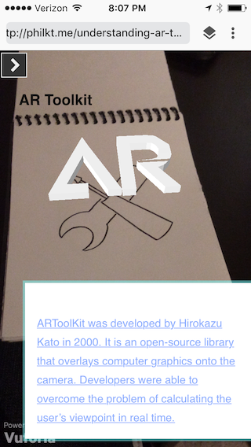
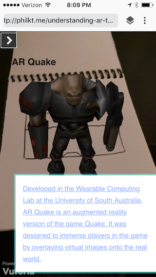

# Understanding AR
### An augmented reality storybook about the development of augmented reality

Developed for the [Augmented Environments Lab](http://ael.gatech.edu/lab/), Understanding AR is a physical storybook inspired by Understanding Comics: The Invisible Art by Scott McCloud that
requires the use of a phone to read. Using [Argon.js](http://argonjs.io/) and [Twine](https://twinery.org/), you can discover the history of augmented reality from the
original creation of the Sword of Damacles to the recent phenomenon of Pokemon Go. Simply visit [the project's webite](http://philkt.me/understanding-ar-twine) on
your phone using the Argon browser, look at a story image, and a rendered 3D model of the picture will appear, along with
explanatory text of why this was an important point in augmented reality history. You can also print out your own storybook using the [pdf](storybook.pdf).

Software used in this project:
* [Argon.js](http://argonjs.io/) for AR on the phone
* [Twine](https://twinery.org/) for storyboard navigation
* [Vuforia](https://www.vuforia.com/) for imaage recognition
* [Blender](https://www.blender.org/) for 3D model creation

### How it works
Using the Vuforia database, once an image is recognized we use the capabilities in Argon and Twine to redirect to the appropriate passage and render a 3D model.
Once you click through, we return to the default state until a new image is recognized.

### How it looks

### To edit this project
1. Clone or download the repo
2. Import the project in Twine using the [understanding-ar html file](understanding-ar.html)
3. Edit the text passages as you see fit
4. You can replace the models as well, but must keep the same naming scheme or change the reference name in the twine storyboard
5. If you want to use your own images to recognize, you must set up your own Vuforia database to use with your project

### Who made it
* [Philippe Kimura-Thollander](http://philkt.me)
* [Victoria Chai](http://victoriachai.me)
* Under the direction of [Jay Bolter](http://www.jdbolter.net/)
* [Blair MacIntyre](https://blairmacintyre.me/) for [the original storybook code](https://github.com/blairmacintyre/oldfashioned) as well as Argon itself
